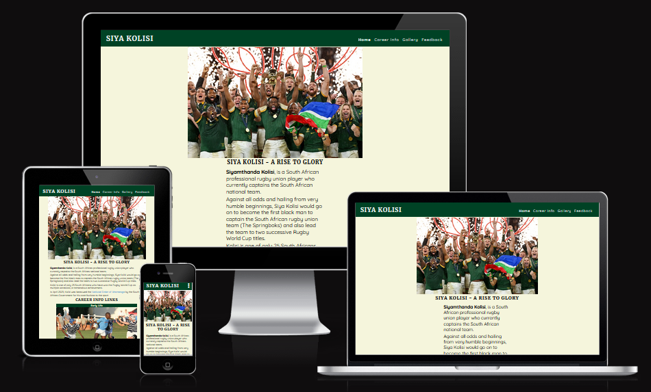
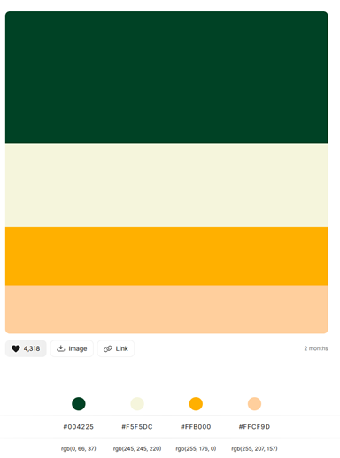

# Siya Kolisi - A Rise To Glory

The Siya Kolisi website is designed to provide a look at the career of the most unlikely, yet most successful and inspirational leader of the Springbok rugby team who led the team to winning two back-to-back rugby World Cup championships.

[View the project website on Github Pages](https://jayleighton.github.io/siya-kolisi-pp1/index.html)

## Contents

- [User Experience](#user-experience-ux)

  - [User Stories](#user-stories)

- [Design](#design)

  - [Colour Palette](#colour-palette)
  - [Imagery](#imagery)
  - [Wireframes](#wireframes)
  - [Typograpyhy](#typography)

- [Feature](#features)
  - [General Features on Each Page](#general-features-on-each-page)
    - [Index Page](#index-page)
    - [Career Information Page](#career-information-page)
    - [Gallery Page](#gallery-page)
    - [Feedback Page](#feedback-page)
  - [Accessibility](#accessibility)
- [Technology Stack Used](#technology-stack-used)

  - [Languages Used](#languages-used)
  - [Frameworks, Libraries & Programs Used](#frameworks-libraries--programs-used)

- [Deployment & Local Development](#deployment--local-development)

  - [Deployment](#github-pages-deployment)
  - [Local Development](#local-development)
    - [How to Fork](#how-to-fork-the-repository)
    - [How to Clone](#how-to-clone-the-repository)

- [Testing](#testing)

  - [W3C Validator](#w3c-validator)
  - [Resolved Bugs](#resolved-bugs)
  - [Known Bugs](#known-bugs)

- [User Story Testing](#user-story-testing)

  - [Performance and Accessibility Testing](#performance-and-accessibility-testing)

- [Credits](#credits)

  - [Code Credits](#code-credits)
  - [Content](#content)
  - [Media](#media)

    - [Index Page Media](#index-page-media)
    - [Career Information Page Media](#career-information-page-media)
    - [Gallery Page Media](#gallery-page-media)
    - [Feedback Page Media](#feedback-page-media)

  - [Acknowledgements](#acknowledgements)

---

## User Experience (UX)

### User Stories

#### First Time Visitor Goals

- To immediately understand the purpose and subject of the website
- To be able to navigate the different sections of the website easily
- To have a method of submitting feedback and register to get notifications of updates
- To be able to use the website on any device regardless of viewport size
- To have common navigation options on every page

#### Returning Visitor Goals

- To be able to provide additional feedback
- To be able to de-register from the notification list

## Design

### Colour Palette

The website uses a color palette which fits the Sprinbok colours of Green & Gold.
The colour palette was obtained from [Color Hunt](https://colorhunt.co)

### Imagery

The imagery on the site is intended to show the Springbok rugby captain during the various stages of his career from his early school clubs through to his international career.

All of the sources of the images have been credited in the credit section of this document.

### Wireframes

Wireframes were created for Mobile and Desktop displays.

- [Wireframe Export](Documentation/Siya%20Kolisi%20PP1%20Wireframes.pdf)

### Typography

Google Fonts was used to provide the sans-serif fonts as follows:

- Merriweather is used for headings and titles
- Quicksand is used for the rest of the body of the website

## Features

### General Features on Each Page

#### Index Page

- The index page provides the user with an introduction to the subject along with links to the relevant sections of the Career info page

#### Career Information Page

- The Career information page offers additional information on each of the stages in the career of Siya Kolisi

#### Gallery Page

- The galley page displays a number of images relating to the Springbok rugby captain.
- The gallery page is responsive and adjusts the number of image columns based on the viewport width

#### Feedback Page

- The feedback page offers the user an opportunity to provide any feedback or comments they wish to provide.
- The user is also able to sign up for a mailing list to receive updates when the page is updated

### Accessibility

Great care has been taken in the design of the website to ensure that it is as accessible as possible.
The following has been included in the website with this in mind:

- Use of semantic HTML
- Descriptive captions on all of the images
- Ensuring sufficient colour contracts with the selected colour palette

---

## Technology Stack Used

### Languages Used

The following languages were used to create this website:

- HTML
- CSS

### Frameworks, Libraries & Programs Used

- Git for version control
- Github - Used to store and save the files for the website
- [Balsamiq](https://balsamiq.com/) - For creating Wireframes
- [Code Anywhere](https://app.codeanywhere.com/) - Used as a remote development environment
- [Google Fonts](https://fonts.google.com/) - Used to import the selected fonts
- [Font Awesome](https://fontawesome.com/) - Used for the icons on the website
- [Free Favicon](https://freefavicon.com/) - Used for the Favicon on the web pages
- Google Dev Tools - Used for troubleshooting HTML and CSS
- [Am I Responsive](https://ui.dev/amiresponsive) - To test the responsitivity of the website

## Deployment & Local Development

### Github Pages Deployment

Github Pages was used to deploy the live website. The instructions follow below:

1. Log in to Github
2. Find the respository for the project
3. Click on the Settings link
4. Select Pages from the tree menu
5. Under the source option, select Deploy from a branch
6. In the Branch section, select the relevant branch
7. Click Save
8. The URL for the live site is displayed at the top of the pages section

### Local Development

#### How to fork the repository

To fork the Siya Kolisi Repository:

1. Log in tgo Github
2. Go to the repository for this website, jayleighton/siya-kolisi-pp1
3. Select Fork at the top of the screen

#### How to clone the repository

To Clone the Siya Kolisi website respository:

1. Log in to Github
2. Got to the repository for this website, jayleighton/siya-kolisi-pp1
3. Click on the Code button at the top right of the screen and select HTTPS, SSH, or GitHub CLI
4. Copy the link
5. Open the terminal on your code editor in the directory where the project needs to be cloned
6. Enter 'git clone' into the terminal and pase the Github link
7. Press enter to clone the repository

## Testing

- Testing has been completed throughout the development process to ensure that all expected functionality and interactivity is working correctly before moving on to the next section of the website.

- Validation of the HTML code has also been completed as each page was completed.

- CSS Validation has been completed at the end of the building process.

### W3C Validator

The W3C validator was used to validate the HTML on all of the pages.

- [Index Page](Documentation/Testing/index-page-html.png)
- [Career Information Page](Documentation/Testing/Career-info-page-html.png)
- [Gallery Page](Documentation/Testing/gallery-page-html.png)
- [Feedback Page](Documentation/Testing/feedback-page-html.png)

The W3C jigsaw validator was used to validate the css in the styles.css file.

- [Style Sheet](Documentation/Testing/style-sheet-validation.png)

### Resolved Bugs

1. Reduced navbar links for Early Life, Professional Career, & International Career to one link for Career Info
2. Added three images on the index page with anchors to the sections for Early Life, Profession & Internaltion Career
3. Career Page image was blurry on larger screens, replaced with higher resolution image
4. Navbar margin spacing was incorrect causing the navbar to cover elements on certain pages

### Known Bugs

1.  The join mailing list feature currently does not subscribe the user to any form of mailing list. Submitting the form only validates the form input.

## User Story Testing

### Performance and Accessibility Testing

Lighthouse was used to perform testing on all pages within Chrome Development Tools. The results follow below:

- [Index Page](Documentation/Testing/lighthouse-index.png)
- [Career Info Page](Documentation/Testing/lighthouse-career-info.png)
- [Gallery Page](Documentation/Testing/lighthouse-gallery-page.png)
- [Feedback Page](Documentation/Testing/lighthouse-feedback-page.png)

## Credits

### Code Credits

- Code Institute
  - Navbar styling and interactivity for smaller screens
  - Layout of columns on the gallery page
  * Hover effect on navbar links and achor tags

### Content

While none of the information on the website was directly copied from any source, the factual information was obtained from [Wikipedia](https://en.wikipedia.org/wiki/Siya_Kolisi)

### Media

#### Index Page Media

- [Cover Image](https://resources.worldrugby-rims.pulselive.com/photo-resources/worldrugby/photo/2023/10/28/1692d2e8-e899-42cd-ac28-b0c843ece5de/1762091396.jpg?width=1680)
- [Early Life Image](https://media.licdn.com/dms/image/C4E12AQFyfOdv304KMg/article-cover_image-shrink_720_1280/0/1528786236122?e=2147483647&v=beta&t=z5J15QWcpEY6ZAxwShsfkj6-9PDyFDe5AIIYaYhORQk)
- [Professional Carreer Image](https://lh3.googleusercontent.com/WVf8rdFIoY__tDKDER1uOPH9kRyaI0Y8FjnHaUgHxKi1XNtrakDFu6t_3XmLkJDbBPju2p49ZNKBlhQa-NCVq6yG5DE_Tl4T6hc=s1500-pp)
- [International Career Image](https://cdn.24.co.za/files/Cms/General/d/11614/e40da41a61cd4515a1ee2a34b7180cd7.jpg)

#### Career Information Page Media

- [Cover Image](https://lh3.googleusercontent.com/qHzGEbJ2ZBq_rAj1sgCbgZJV4peNCWWA-YQZzKwxo2-v5MjcAWhYdRzzUUJ09CXNbIPqhd6JqAWAglLax6cQhF7N3U-nkUKKzxEq9xMPVopKVA=s1200)
- [Early Life Image](https://www.telegraph.co.uk/content/dam/rugby-union/2018/06/07/TELEMMGLPICT000165675713_trans_NvBQzQNjv4Bq-wioWl5aH7fAEJ8IWJw2Y29B1LEDEnWrF26oEaqVPuY.jpeg?imwidth=480)
- [Professional Career Image](https://cdn.primedia.co.za/primedia-broadcasting/image/upload/c_fill,h_437,w_700/d78uzlmlcg6vgeifzo1v)
- [International Career Image](https://www.thetimes.co.uk/imageserver/image/%2Fmethode%2Fsundaytimes%2Fprod%2Fweb%2Fbin%2F0e9d011a-32cf-11ea-81b4-81217bc4782e.jpg?crop=1500%2C1000%2C0%2C0)

#### Gallery Page Media

- [Gallery Image 1](https://static.independent.co.uk/2023/10/29/20/newFile.jpg)
- [Gallery Image 2](https://m0.sportsjoe.ie/wp-content/uploads/2023/09/24123543/GettyImages-1685062477.jpg)
- [Gallery Image 3](https://e0.365dm.com/19/07/2048x1152/skysports-siya-kolisi-south-africa_4724413.jpg)
- [Gallery Imag 4](https://ichef.bbci.co.uk/news/1024/branded_sport/996D/production/_101777293_kolisi_getty.jpg)
- [Gallery Image 5](https://www.sarugby.co.za/media/znli1c3y/231026-siya-kolisi-springboks.jpg?anchor=center&mode=crop&width=945&height=472&rnd=133428724074870000)
- [Gallery Image 6](https://i.guim.co.uk/img/media/978694f52e2a1192b5decb46c15c4d3c6a85ec3f/0_0_3511_2107/master/3511.jpg?width=1200&quality=85&auto=format&fit=max&s=066cbe453b18e26b7f0d30a8d5ffa3c4)
- [Gallery Image 7](https://www.sarugby.co.za/media/anvpqgbs/190905-pieter-steph-du-toit-springboks-50th-test.jpg?anchor=center&mode=crop&width=945&height=472&rnd=132380793134700000)
- [Gallery Image 8](https://www.springboks.rugby/media/gsgiloev/230808-siya-kolisi-springboks-rwc.jpg?anchor=center&mode=crop&width=945&height=472&rnd=133365612807730000)
- [Gallery Image 9](https://risesport.co.za/wp-content/uploads/2023/10/IMG_1262-1024x683.jpeg)
- [Gallery Image 10](https://images.ps-aws.com/c?url=https%3A%2F%2Fd3gbf3ykm8gp5c.cloudfront.net%2Fcontent%2Fuploads%2F2023%2F11%2F13162528%2FFrances-Antoine-Dupont-challenges-for-the-ball-with-South-Africas-Siya-Kolisi-during-the-Rugby-World-Cup-quarterfinal-1200x630.jpg)

#### Feedback Page Media

- [Background Image](https://www.thetimes.co.uk/imageserver/image/%2Fmethode%2Fsundaytimes%2Fprod%2Fweb%2Fbin%2F0e9d011a-32cf-11ea-81b4-81217bc4782e.jpg?crop=1500%2C1000%2C0%2C0)

### Acknowledgements
